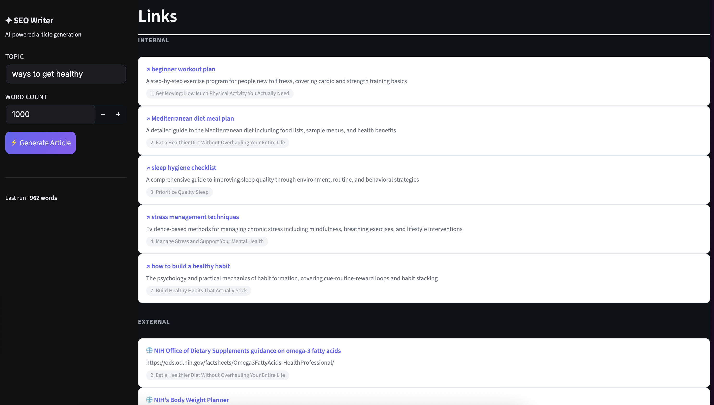
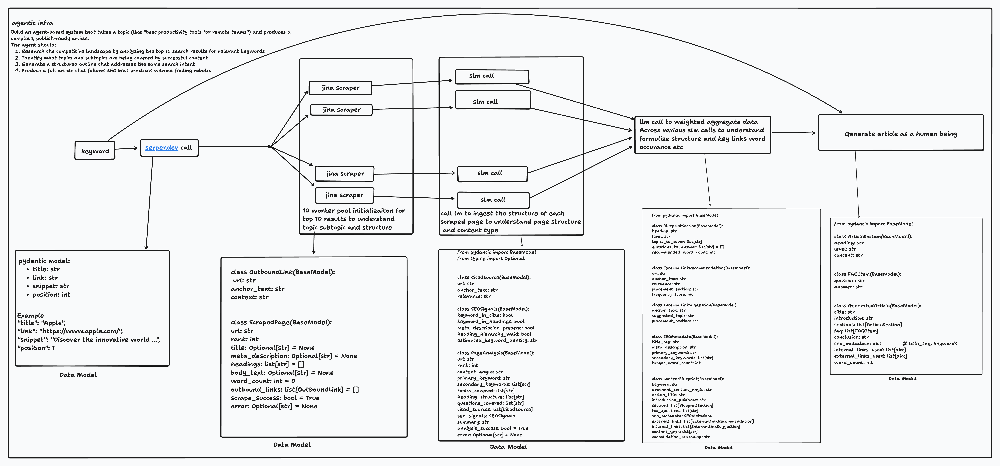

# SEO Article Generation Agent

An AI-powered pipeline that researches the competitive SERP landscape for any keyword and produces a publish-ready, human-sounding article that follows SEO best practices.

---

## DEMO

**Pipeline in progress**


**Generated article title & introduction**


<table>
  <tr>
    <td><strong>FAQ section</strong><br/></td>
    <td><strong>Internal & external links</strong><br/></td>
  </tr>
</table>

---

## Setup

**Install dependencies**
```bash
pip install -r requirements.txt
```

**Environment variables**

Create a `.env` file in the root directory:
```properties
SERPER_API_KEY=       # serper.dev
FIRECRAWL_API_KEY=    # firecrawl.dev
ANTHROPIC_API_KEY=    # platform.claude.com
```

---

## Architecture



The pipeline is built around the idea that generating a good SEO article is fundamentally a research and synthesis problem before it is a writing problem. Most AI content tools skip straight to generation — they take a keyword and ask a model to write. The output reads like it. This system inverts that: 80% of the work happens before a single word of the article is written.

### Stage 1 — SERP Research (Serper.dev)
The pipeline starts by fetching the top 10 Google results for the target keyword via Serper. These aren't just used for URLs — the titles, snippets, and positions are preserved as signals throughout. Position is treated as a proxy for quality: rank #1 gets more weight than rank #7 at every downstream stage.

### Stage 2 — Content Extraction (Firecrawl + BeautifulSoup + Trafilatura)
Each of the 10 URLs is scraped via Firecrawl which returns raw HTML. That HTML passes through two independent extraction tiers:

- **BeautifulSoup** runs first and extracts outbound links found inside `<p>` tags only. This heuristic isolates in-content citations and filters out navigation, footer, and sidebar links which carry no signal.
- **Trafilatura** runs second and extracts clean body text, headings, title, and meta description. It strips all boilerplate — ads, nav menus, cookie banners — and returns only the article content.

Both tiers run on the same raw HTML and their outputs are merged into a single `ScrapedPage` object per URL. If Firecrawl fails on a URL, the pipeline degrades gracefully to the SERP snippet so downstream stages always have something to work with.

### Stage 3 — Per-Page SEO Analysis (Claude Haiku)
Each `ScrapedPage` is passed to Claude Haiku independently — 10 sequential calls. Haiku is the right model here because this is a structured extraction task, not a reasoning task. It identifies the content angle, primary and secondary keywords, subtopics covered, questions answered, and evaluates which outbound links carry genuine authority. Prompt caching is used across all 10 calls so the system prompt is only billed once.

### Stage 4 — Blueprint Consolidation (Claude Sonnet with Extended Thinking)
All 10 `PageAnalysis` objects are passed to Sonnet in a single call. This is the most intellectually demanding step in the pipeline. Sonnet reasons across all 10 analyses with rank-weighted logic — patterns in positions 1–3 carry more weight than patterns in positions 7–10. It identifies which subtopics are non-negotiable (covered by 7+ pages), which represent differentiation opportunities (only in rank #1), and which are noise (only in low-ranking pages). Extended thinking is enabled here so Sonnet can reason across competing signals before committing to a structure. The output is a `ContentBlueprint` — a precise article specification covering heading architecture, section-level word counts, FAQ questions, external source recommendations, internal link suggestions, and SEO metadata.

### Stage 5 — Article Generation (Claude Sonnet with Extended Thinking)
The `ContentBlueprint` is passed to a second Sonnet call configured specifically for human-sounding writing. The prompt enforces voice, bans known AI writing fingerprints, and prescribes opening patterns that retain readers. Extended thinking is enabled so Sonnet plans the article's narrative arc before writing — this is what produces coherence between sections rather than isolated paragraphs that happen to be adjacent. The output is a complete `GeneratedArticle` with structured sections, FAQ, conclusion, and all link placements documented.

---

## Engineering Roadmap

### Job Persistence & Resumability
> *Planned*

The pipeline currently runs end to end in a single process. The next engineering priority is breaking it into durable, resumable jobs. Each stage will write its output to a persistent store (Redis or Postgres) before the next stage begins. If the process crashes after SERP data is fetched but before scraping completes, the job resumes from where it left off rather than restarting from scratch. Planned checkpoint states:

```
PENDING → SERP_FETCHED → PAGES_SCRAPED → ANALYSES_COMPLETE → BLUEPRINT_READY → ARTICLE_GENERATED → DONE
```

### Job Management API
> *Planned*

A lightweight REST API for submitting generation jobs, polling status, and retrieving completed articles. Each job will have a unique ID, status, and timestamped stage transitions for observability.